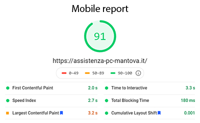
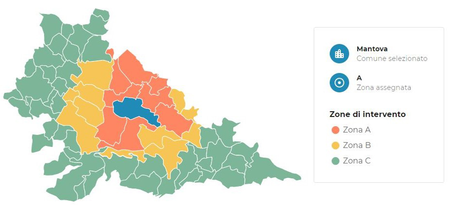

# react-business-website

SEO optimized React website for a local IT assistance service located in Italy. [Link to the real website](https://assistenza-pc-mantova.it/).




# Features & optimizations

- Essential resources preloading
- Off-screen components deferred to reduce the First Contentful Paint
- Requires WebP images for non-Safari user agents and jpg as fallback
- Resolution based images fetching
- Postpone non-essential code with React.lazy
- Optimized service worker for offline usage and resources prefetching
- Promise polyfill for old browsers

# Interactive map

SVG map with listeners attached on its inner elements. [Try the map](https://assistenza-pc-mantova.it/prezzi)



To add interactivity on a SVG image you need to assign each layer/group/element in your vector project a valid and unique ID, and keep it in the exported svg file. Webpack loaders such as @svgr/webpack will, by default, delete them to minimize the bundle size when loading the file. To avoid this, you need to explicity skip the execution of some plugins to preserve IDs with a separate rule.

```js
const rules = [{
 test: /\.svg$/,
        use: [
            {
                loader: '@svgr/webpack',
                options: {
                    svgoConfig: {
                        // Preserve layer ids
                        plugins: [{ cleanupIDs: false, prefixIds: false }],
                    },
                },
            },
        ],
}]
```

# Realized with:

- Typescript
- React
- Webpack
- Babel
- ESLint & Prettier
- Workbox
- Firebase (hosting & functions)
- Material UI
- SASS
- Google Analitycs

**Other minor packages:**

- react-wait-content
- react-google-recaptcha
- react-scroll-parallax
- nodemailer (backend)

# Scripts

| Command          | Description                |
| :--------------- | :------------------------- |
| `start`          | Start webpack dev server   |
| `build`          | Webpack build              |
| `lint`           | Run ESLint                 |
| `lint:fix`       | Run ESLint autofix         |
| `deploy:hosting` | Deploy to firebase hosting |

# License

MIT
